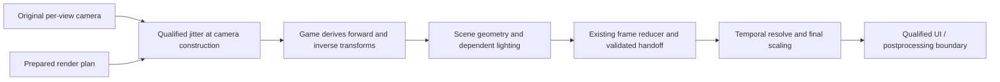

# Flat temporal AA through upstream camera construction

## Status

- State: C2 is complete and green (c2 derive, c2 warp, c2 coexist in the
  build pool). Producer discovery, the function-level lineage, the derive
  reducer, the WARP geometry/lighting proofs and the coexistence policy
  are all landed and cited in the addenda; the field schema is one
  camera-relative typed table. The auxiliary composer callers remain
  unclassified by behavior, and the complete view/execution lineage
  (which passes run which refresh on which thread, record vs replay) is
  not yet joined. C3 is planned, not built — live mutation stays off.
- Decision: investigate jittering the game's per-view camera construction
  before it derives raster/lighting data. Preserve the existing frame
  discovery, size negotiation, temporal backends and resource isolation.
- Motivation: the build-verified 20260928_025912 user log reports zero renderer
  calls; three recurring unknown projection pairs keep every frame in
  observation. Sean reproduced non-activation with another ship; its exact
  shader correspondence remains unverified.
- Open hypotheses: a common producer covers the derived transforms; camera
  domains and recording epochs can be distinguished before mutation. The
  camera-struct hook point is a candidate, not a validated design.
- Ruled out for that session: a backend evaluation failure as the immediate
  cause, because no backend initialized. Missing shader coverage is proven;
  whether quality settings or a mod produced those variants is not.
- Next: C3, per the C3 wiring plan addendum -- the FUN_1405921f0 detour
  behind a default-off key, the ownership policy wired into flat_runtime,
  the classifier's jittered-encoding question answered, then one bounded
  session against the acceptance criteria there.
- Environment: Windows x64, D3D11 flat mono; headset/runtime N/A. VR
  comparison: EDVR's OpenVR/OpenXR route. Record GPU/driver, executable/build
  identities, backend versions, dimensions, formats and mod chain for
  qualification.
- This document extends the [flat AA
  design](design-flat-temporal-aa-2026-09-23.md) and [architecture
  review](review-flat-temporal-aa-2026-09-26.md). Its camera milestones below
  supplement, rather than renumber, their existing gates.

## 1. Problem and acceptance requirements

VR supplies Elite's eye projection through a runtime interface. EDVR applies
jitter there and Elite derives rendering data from that camera. See
`native_temporal.cpp`'s tangent-shift publication and
`openxr/openvr_system.cpp::GetProjectionMatrix/GetProjectionRaw`.

Flat's current adapter instead discovers a scene through D3D11 observations and
patches private constant buffers at draw/dispatch boundaries. It must recognize
each relevant projection consumer. At `418e5231`, unknown recipes call
`refuseDraw`; observation ends only after a completely covered frame. One
unfamiliar pair every frame therefore prevents all temporal treatment.

The user log shows 704/704 frames refused, `calls=0 init=0` and `partial=on
observing=1`. Retrieve its already-saved six stage bytecode files and
`flat_trace_13562.bin`, omitted by the support ZIP, before another flight.
Captures must not become a permanent requirement to authorize each ship.

The replacement must satisfy:

1. Support device/backend resolutions, including odd extents, crops and
   supersampling, using actual dimensions without hidden quality reduction.
2. Reconfigure and resume after supported quality/size changes without a
   restart. Indefinite warming is a failed qualification.
3. Support compatible EDHM/ReShade chains; name incompatible contracts.
4. Admit ships/materials through camera lineage, without per-ship allowlists.
5. Preserve disabled behavior and VR scheduling. Object-motion coverage is
   separate: camera-only motion may limit quality while valid AA continues.

This change does not automatically solve scene/depth discovery, DoF/HDR
handoffs, UI composition or moving-object motion. Those contracts remain.

## 2. Target boundary and ownership

Proposed flow; the upstream producer box is not yet located:

Prefer a per-view finalization boundary before projection-dependent matrices,
view rays and screen-to-world constants are derived. Change raster projection,
not world pose or simulation. Preserve the original camera and let the game
produce coherent derivatives from the modified input.

There must be one jitter owner for each scene phase group. A group contains all
passes sharing the scene's sampling grid/depth: it may include a main camera
plus cockpit or weapon cameras with different near planes. They must receive
compatible pixel offsets, not necessarily identical matrices.

Shadow, reflection, cube-map and UI cameras are not main-camera candidates
merely because their matrices or constant-buffer addresses look similar. Leave
independent domains unchanged. A secondary camera that contributes to the
shared scene must be explicitly related to its phase group or block that group.
Composite-only UI can remain outside it at a validated boundary.

Keep CPU visibility/culling stable and conservative over the jitter envelope.
If the candidate also builds culling data, prove how stable/conservative
culling coexists with jittered raster data; do not accept phase-dependent
visibility popping as AA. Preserve reversed-Z, depth range, FOV, asymmetric
frusta, viewport/crop and matrix storage conventions.

Unknown material hashes cease to be an admission barrier only for work whose
camera derivation is covered by this contract. A different shader hash is not
itself a violation; a new camera source or rewritten projection is.

## 3. Find the producer without assuming one exists

Existing anchors identify consumers, not a canonical constructor:

- `flat_temporal_model.h` observes scene b1[270..275]; `flat_runtime.cpp` and
  `vscreen.cpp` observe CPU writes before Unmap.
- `flat_camera_probe.h` samples an exact-pair conflict; `camera_view.h` reads
  external-camera mode. Neither provides an upstream projection API.
- Kinematic records are object poses. [Camera-row carry
  evidence](camera-rows-carry-2026-09-25.md) shows why latest/plausible rows
  cannot distinguish auxiliary views. The VR row layout is not a flat camera
  ABI.

Walk measured upload callers backward to their source objects and derivation
order. Compare these hypotheses in the same investigation:

| Candidate | Evidence required | Disqualifying result |
| --- | --- | --- |
| Per-view camera finalizer | Stable view identity; proposed mutation point precedes all relevant derived reads/writes | Some derivatives escape that point, or identity is ambiguous |
| Scene-constant packer | Proves every dependent product is built/rebuilt here | Merely copies already-derived matrices; other packs escape |
| Render-context/view-table builder | Joins camera domain and generation to subsequent scene traversal/uploads | It identifies only culling/auxiliary views or runs after consumers |

Record executable fingerprint, caller locations, source object/generation,
matrix values, destination range/write epoch, thread/context, view/pass and
downstream lineage. Frequency alone cannot select a producer. Do not invent
RVAs, calling conventions or a global camera pointer.

Before patching, validate the unique locator, instruction boundaries, ABI,
forwarding and lifetime against the executable and structural/callsite/store
checks. Unknown builds, ambiguous matches and conflicting patches disable the
integration. Reuse the existing hook mechanisms after this proof.

## 4. Passive evidence and bounded probes

First replay existing data and inspect exact bytecode. Then instrument all
plausible causes together. Sample still view, a deliberate pan, main/secondary
camera transitions and one scale change in a single prepared session.

Join producer entry/mutation/return, derived writes/uploads, bindings,
scene/depth writes and handoff by view, generation and execution order. Pointer
equality or Present alone is insufficient. Distinguish command-list recording
from replay, including repeated execution.

Initial capture limits: 240 metadata/small-matrix frames per segment, two
full-payload frames, four segments, 4,096 events/frame and 64 MiB total. These
are diagnostic budgets, not lifetime admission limits. Log caps, drops and
incomplete joins; overflow invalidates proof. Adjust from measured counts.

Discriminators: shared upstream sources support a common finalizer; derivatives
preceding the proposed mutation point refute that point; auxiliary views refute
a global-camera model; record/replay mismatches refute immediate-only lifetime.
Derivation inside the original constructor is valid when injection precedes it,
for example at its entry.

Emit armed/hook-hit/producer/join/overflow/completion counts, including zero.
Persist replayable evidence; include referenced trace/shaders and truncation
reasons in the support bundle. A silent hook is not a successful probe.

## 5. Proposed camera contract and early preparation

The existing `FlatFrameContract` is produced at output-copy time. It cannot
authorize an earlier camera mutation. Add a separate immutable early plan and
compare it with the completed frame contract; do not create a second scene
selector. The following are proposed records, not current APIs:

| Record | Required contents |
| --- | --- |
| Early render plan | Game/hook/device generations; view and phase-group identity; input/output resource generations and descriptors; R/E/D extents; crop/viewport mappings; backend/model; prepared-resource lease; expected derivation epoch |
| Camera application | Original camera snapshot; actual jitter in render pixels; derived-producer identities; view/recording/execution epochs; one-shot application result; reason on decline |
| Frame closure | Join to actual color/depth/handoff; all relevant camera derivations accounted for; actual sizes and phase; temporal accepted or recovery result; history commit/reset reason |

R is scene rendering, E backend evaluation, D display output. Convert jitter
using R and the viewport, never D/E. Preserve current negotiation: trained
backends normally use E=D for upscaling and E=R for supersampling, followed by
final scaling to D, subject to backend limits. Current TAA evaluates and stores
history at D; render-grid TAA is a separate deferred change. Include negotiated
E, formats, subresources and mappings in resource/history identity.

Bootstrap from zero-jitter observation and the reducer's scene/depth/handoff
selection, even while legacy shader coverage refuses. Upstream admission needs
separately counted producer/derivation proof; legacy refusal must not reset its
warm-up or history. Existing source selection also uses pool-family and
camera-row assumptions: extend it to proven producer/target association where
needed, never bypass scene selection wholesale.

On the render owner, prepare for the next eligible construction. Revalidate
identity, generations, sizes and readiness before mutation. A previous frame is
a prediction, not authority. Changed/unprepared plans remain stock.

Worker hooks must not call D3D, initialize backends or wait on GPUs. Publish
owned immutable records through a bounded thread-safe channel; overflow is a
named refusal. Never retain mapped/stack pointers. Preserve nested caller
attribution; quiesce in-flight users before reclamation without lock deadlock.

Apply jitter to an original/private camera copy with proven consumer lifetime.
Repeated construction uses the same phase without accumulating offsets.
Deferred consumers retain their generation through execution. Separate applied
phase from accepted history; failures cannot replay old evidence as fresh.

Publish both original and rendered camera records. Feed certified unjittered
rows to `FlatMonoResolveFrame.camera/previousCamera` and original scene
snapshots to engine motion's `sceneNow/scenePrev`, with actual raster jitter
carried separately. Upstream-modified uploads cannot silently become those raw
inputs. Prove provenance rather than guessing de-jitter transforms for unknown
layouts. Test normal, disabled, failed and history-reset paths for double
correction and preservation of raw motion inputs.

## 6. Transaction, transitions and recovery

Normal states are Observing -> Prepared -> Active. A violated contract moves to
Recovery and subsequent zero-jitter observation. Each state has a reason,
current generations and counters; stable supported scenes must progress.

Before first consumption, failure means no camera mutation. After camera data
is consumed, do not switch phase, turn on legacy per-draw patches or pretend
restoring a CPU matrix undoes drawn geometry.

At handoff compare resources, derivation identity, sizes and phase with the
plan. Only matching closure authorizes temporal history. Reject camera cuts,
missing/late writers, overrides and replay mismatches.

`flatMonoResolvePreflight` proves renderer/fallback resources and backend
availability, not size-specific vendor feature creation. Late backend failure
can use preallocated spatial recovery only for *proven coherent* jitter and
valid inputs, leaving history invalid. Unknown/mixed phase instead declines
EDVR replacement, invalidates history and stops subsequent jitter; acknowledge
the possible one-frame artifact. Device/allocation failure may prevent
recovery. No re-render or perfect rollback of mixed pixels is assumed.

Quality/ship/camera/size/fullscreen/device/backend/model changes invalidate
affected generations. Reprepare, reseed and release retired resources after
outstanding users finish. Prohibit ever-growing maps and steady allocations.
Exhaustion is a named unavailable state, not an endless per-draw retry.

## 7. Existing adapter and mod compatibility

Retain reducer, depth/color provenance, negotiation, motion, retirement and
state restoration. Version replay's new producer evidence; old traces cannot
certify an upstream hook they never recorded.

First run both observers without upstream writes. At activation select one
injector per group: legacy patches OR upstream construction. Suppress legacy
projection mutation under upstream ownership; retain observations and motion.
Switch only after outstanding work closes and history resets. Keep the legacy
route for environments it qualifies; never switch injectors mid-frame.

EDHM color/material variants consuming certified camera data should need no new
hashes. Camera/inverse/depth/composition changes require explicit contracts.
Detect post-construction writers by changed derivation/resource lineage.

For ReShade, verify loader/hook and AA/UI/effect order; preserve forwarding and
D3D state. Test each mod alone and together. Depth/projection replacement or
another temporal reconstruction may need integration or remain unsupported.

Keep user-facing AA settings unchanged. Report selected versus effective
treatment and a useful blocked reason instead of perpetual "warming". No
feature/config removal or rename is authorized by this design.

## 8. Delivery milestones and stop conditions

| Milestone | Required evidence before proceeding |
| --- | --- |
| C0: baseline | Reproduce logged classifier refusals; obtain saved bytes/trace; enumerate domains and candidate callers; no mutation |
| C1: producer discovery | Passive trace identifies domain/lifetime/ABI and proves ordering for all relevant derivatives; a counterexample rejects that boundary |
| C2: offline implementation proof | Pure event/reducer tests plus WARP geometry/lighting tests validate matrices, ownership, generations and recovery; existing suites remain green |
| C3: controlled activation | Full validation build; one bounded game session verifies actual producer -> derived data -> scene/depth -> accepted history with no duplicate jitter or uncovered domain |
| C4: qualification and promotion | Different ships/cameras, supported quality/size/backend changes and mod combinations work without new admission hashes; bounded resources and measured overhead; VR regression checks pass |

If no complete upstream boundary exists, publish the missing dependencies and
retain the existing adapter. A packer hook is acceptable only if it satisfies
the same complete-derivation proof, not as an undocumented partial substitute.

Desktop tests: forward/inverse/depth/ray consistency; raw motion preservation;
storage/reversed-Z/asymmetric projection; R/E/D routes and crops/odd sizes;
interleaved views; nested/worker calls; partial uploads; pointer reuse;
delayed/repeated replay; mid-job disable; late writers; duplicate jitter;
post-application backend failure; unrepairable mixed phase.

Live matrix: working/failing ships and distinct cockpits/canopies; on-foot/
weapon views; camera/menu/docking/flight transitions; presets/effects;
below/native/above-1.0 SS; resize and mod chains. Ship/camera-family diversity
is regression coverage, not a production allowlist or proof of arbitrary mods.

Counters: producer/derivation epochs, injector, applied jitter, closure,
treatment/history streaks and reset reasons. No persistent observation, mixed
phase, stale generation or hidden steady fallback. Compare CPU/GPU cost with
the existing adapter at the same scene/size. Steady state allocates nothing,
does no blocking readbacks/captures; resolve regressions before promotion.

## C2 test plan addendum, 2026-09-28: reducer, WARP and coexistence

C2 is an offline gate: no game session is required or sufficient. Every
test names its discriminating signature and its stop condition up front,
because a failed proof here retains the existing adapter unchanged.
Revised per the C2-plan review: the field schema is the camera-relative
typed table in the cache-helper addendum; the ray basis is modeled from
its resolved typed writer; phase, rollback, ownership, lighting and the
size matrix follow the production policies they must eventually exercise.

### C2-A: the derive reducer (pure event/matrix rig)

A new rig under `tools/` reimplements ONLY the semantics read out of the
decompiles -- the projection builder (FUN_1404f2ff0, all five kind
branches: 1 ortho, 3 trigonometric, 4/5 custom-matrix from +0x2D0..+0x30C,
default), the view/VP/ray finalizers (FUN_1404f4910 / FUN_1404f49f0 /
FUN_1404f3770) and the composers (FUN_140596830, FUN_1405964c0) -- each
reduction cited to its decompile file and line. A divergence between rig
and decompile is a rig bug, never papered over with a fudge factor.

| Test | Signature that passes | Stop condition |
| --- | --- | --- |
| A1 exactly-once | Jitter at the frustum params; derive twice through the protocol; both VP products identical, and the resulting raster-pixel shift (after the final projection, per kind branch) equals the phase -- raw matrix coefficients are NOT assumed to survive unscaled through every branch | Any double-scaled, missing, or branch-dependent-untracked term |
| A2 bit protocol (negative control) | Mutate without raising bits: downstream reads stay STALE, matching the decompile's guard behaviour. With bits raised, the CORRESPONDING blocks re-derive: cached matrices (projection, VP) via 4/8; directly-read parameters are never cached at all; the +0x870/+0x8B0 snapshots are modeled as independently supplied state (FUN_1406be790's semantics), and a stale-snapshot input is a required negative case. Masks 4, 8, C and D are exercised through the observed call sequence | Re-derivation without the bits; staleness with them; a block claimed to re-derive that the sequence never touches |
| A3 canonical mutation form | Frustum-param mutation and direct projection-matrix mutation produce identical VP within float tolerance across kinds 1, 3 and the default branch; kinds 4/5 (custom-matrix) are either proven equal or explicitly REFUSED by name before mutation | A divergent branch left unnamed, or mutation allowed against an unproven kind |
| A4 override composition | The ACTUAL setter sequence is modeled: per-item pokes to +0x25C (compound-near) and +0x280 (angular) applied after jitter, then the section refresh; the composed projection carries the override and the jitter term survives in raster-pixel shift | Jitter scaled, lost, or applied to the pre-override values; a test that only pokes near/far (which the real setters do not do) |
| A5 phase, generation and replay (five cases, replacing source-generation keying) | 1) Repeat derivation within one phase-group execution: same phase, no accumulated offset. 2) New eligible execution with unchanged source bytes (a stationary camera): the sampling sequence CAN advance. 3) Per-item source revision within that execution: affected derivatives rebuild, the group's pixel phase is preserved. 4) Pointer reuse or resource/hook generation change: stale ownership/history rejected even with numerically identical matrices. 5) Deferred recording/replay: recorded phase and identity retained; late/repeated execution cannot masquerade as a fresh derivation or history sample; incompatible reuse is refused by name | Any case answered by wall-frame index or by source-byte freshness alone |
| A6 failure and disable, split at the consumption boundary | Before any consumer: no camera mutation may reach rendering (clean refusal). After mutation but before consumption: abandon without publishing. After the first consumer: retain the committed phase for the frame's remaining work, forbid legacy takeover, invalidate temporal history, and stop subsequent jitter -- no perfect-rollback claim. Covered at: before preparation, after mutation before consumption, after the first consumer, at backend evaluation, and at handoff | Any mixed-phase frame; any "rollback" that changes already-consumed pixels; legacy path taking over a failed upstream frame |

### C2-B: WARP geometry and lighting harness

A minimal user-mode D3D11 renderer (WARP device, no game, no EDVR) draws
known geometry through shaders consuming a 336-row scene CB with camera
rows 270..275 plus the frustum-ray and depth blocks in the refresh's own
layout. The derive math runs on CPU per the reducer. Conventions are
stated up front: pixel-center, depth and matrix conventions, and every
tolerance.

| Test | Signature that passes | Stop condition |
| --- | --- | --- |
| W1 raster shift across the size matrix | Centroid shift of a known grid equals the phase in ACTUAL R pixels, at 0.5x, 1.0x, 1.5x and 2.0x, including odd dimensions, asymmetric viewport/crop, and independent R/E/D changes. Supersampled paths (DLSS/DLAA/FSR evaluating at E=R and scaling to D) and TAA (evaluating at D) each follow their negotiated agreement: one final scaling to D, no hidden quality reduction | A size-dependent shift; a path evaluated at the wrong extent; two scalings |
| W2 forward/inverse/ray | Per-pixel unproject through the frustum-ray path and reproject through VP round-trips within stated tolerance, jitter on and off, including the stale-snapshot negative case (a view-stale +0x870 must be detected, not absorbed) | VP and ray path disagree anywhere; stale basis passing as fresh |
| W3 lighting at corresponding surface points | Position, normal, view direction and shading compared at CORRESPONDING surface points with explicit tolerances and separate coverage checks (silhouettes legitimately move under jitter); spatially varying lighting, a specular highlight and nonzero translation expose stale rays; authoritative pose/light inputs preserved | Shading divergence beyond tolerance at corresponding points; the scene engineered uniform enough to hide stale reconstruction |
| W4 reversed-Z / asymmetric | W1 and W2 repeated under reversed depth and an asymmetric (projection-adjust) frustum | Any failure specific to either convention |
| W5 motion preservation | Two-frame synthetic pan: the camera-only term from VP_prev^-1 x VP_curr equals the pan after the backend's own jitter accounting; per-pixel motion matches analytic reprojection | Motion term polluted by jitter in the backend's own convention |
| W6 reconfiguration between preparation and consumption | Size, target generation, backend/model or a projection-affecting quality change lands between preparation and handoff: the stale plan is refused by name, no stale history is accepted, resources retire after outstanding users, and resumption on the stable supported replacement is bounded | Any accepted stale plan/history; unbounded re-warming |

### C2-C: coexistence, ownership and closure with the legacy path

These tests exercise the PRODUCTION selector, ownership, phase and
closure logic with the game-camera model as input -- not an abstract XOR
of booleans, and not the legacy adapter's admitted subset as the
universe of frames.

| Test | Signature that passes | Stop condition |
| --- | --- | --- |
| C1 single owner | A known legacy pair eligible for both routes gets exactly one selected owner before mutation; legacy graphics AND compute mutations are suppressed under upstream ownership (both paths' scope mutation is covered) | Any frame mutated by both, or ownership assigned after mutation |
| C2 unknown shaders cannot veto certified lineage | A certified upstream lineage with an unknown or color-only shader variant reaches accepted history WITHOUT legacy admission hashes; legacy observation continues, its refusal does not veto upstream work | The old shader allowlist remaining the effective gate |
| C3 named safe outcomes | A true late projection rewrite or an uncovered secondary camera invalidates closure/history and produces a NAMED safe outcome (observing, unprepared, unsupported, recovery) -- all valid states, but a stable supported scene must make bounded progress out of them | Silence, or a stable scene parked in observation |
| C4 interleaved views | Interleaved main/cockpit/auxiliary views and near-plane variants retain group-level ownership; frame-wide counts cannot hide one path jittering a different view | A count that sums over views with mixed ownership |
| C5 ownership switch | Switching ownership waits for outstanding work, resets history, and preserves original camera inputs for motion reconstruction | A switch that strands in-flight work or poisons the motion inputs |
| C6 steady-state cost | CPU/GPU cost of the injector vs the adapter at equal scene/size, measured offline; steady state allocates nothing, performs no blocking readback. (Equal-scene GAME cost is C3/C4, not claimed here) | A regression the counters cannot explain |

### What C2 does not decide

Live activation, live hook cadence, mod loader order, game performance,
per-shader consumption in the real scene, per-ship coverage and
mod-chain qualification remain C3 (one bounded session: producer ->
derived data -> scene/depth -> accepted history, no duplicate jitter, no
uncovered domain) and C4 (qualification matrix). The injector's config
surface is designed here but defaults off; live mutation stays disabled
until these gates pass; no feature removal or rename is authorized.

## C3 wiring plan addendum, 2026-09-28: the injector's integration

Everything below is design against the mapped chain, not built code. C2's
proofs hold for this exact integration shape; a change to the detour
point, mutation form or ownership call sites re-opens the relevant tests.

### Detour point and form

One CodeHook on FUN_1405921f0, installed with the producer probe's
discipline (prologue verification against the Ghidra bytes, gate-first
relay, hold-open for process lifetime, no uninstall on disable). The
refresh is the only mutation point: it runs after the setters in each
section, and every projection-dependent consumer derives inside it.

Per detour call, when the ownership policy names Upstream for the call's
view-group:

1. Read the camera struct pointer (the refresh's third argument; the
   view+0x158 vs view+0x250 vs auxiliary distinction the setter map
   established) and its projection kind at camera+0x264. Kind 3, kind 1
   or the default branch: proceed. Kinds 4/5 or anything else: mark the
   group upstreamUnsupported for the policy (named; no mutation).
2. Apply the phase in the bound pair, absolutely: boundX = baseX + jx/R,
   boundY = baseY - jy/R_h (the D3D sign convention W1 proved), where R is
   the negotiated evaluation extent from the existing flat runtime state.
   The phase comes from the production temporalJitter sequence at the
   existing FlatLivePhase machine's phaseSequence.
3. The base pair is captured per camera-struct pointer per phaseSequence:
   the first detour call for a (pointer, sequence) records the current
   values as base and applies base+phase; later calls at the same
   (pointer, sequence) re-apply the identical absolute value (A5.1's no-
   accumulated-offset, and A4's composition with mid-frame setters, which
   poke different fields). A base that changes between calls at one
   sequence without our write is a base-rewrite: count it, recapture, and
   name it in the per-5s line.
4. Raise dirty bits 4 and 8 (projection and cached VP; the mutation
   protocol: the refresh copies the CACHED VP when bit 8 is clear, so a
   projection edit without bit 8 is silently stale). Bits 2/1 are not
   raised: a projection-only jitter leaves the view rows and the ray
   snapshots legitimately unchanged (the consumer-lineage addendum).
5. Call the original refresh through the trampoline. Its finalizers
   re-derive the projection, the cached VP, the scene CB and the depth
   CBs from the mutated parameters in the same call.

### Ownership integration points

flatCameraOwnerSelect (src/d3d11/flat_camera_ownership.h, the policy the
C2-C rig proves) is consulted once per view-group per frame BEFORE any
mutation, at the two existing decision points in flat_runtime.cpp:

- In the draw path, where projection plans apply private rows today
  (flat_runtime.cpp:1820-1823, and its compute siblings at :1615-1618):
  under Upstream ownership the legacy scope mutation is skipped by name
  (a counter, not silence); under Legacy ownership it runs exactly as
  today.
- The detour consults the same decision: it mutates only when the
  decision named Upstream for this group. refuseDraw/observing semantics
  (:970-986, :1830) are unchanged and feed the policy's legacyEligible /
  legacyObserving inputs.

The per-frame close follows the production discipline: the detour marks
"mutated at refresh N"; flat_runtime's scene-draw evidence notes applied
when a treated CB binds to an eligible draw (the noteApplied discipline
of flat_live_phase.h:49-52); the ownership close then records the owner,
and the FlatLivePhase machine's fail/finish paths keep their A6 boundary
semantics untouched.

### The classifier's jittered encoding

The production projection ownership classifier's measured encoding
requires camera[i][2] == 0 exactly (flat_projection_ownership.h:75-80).
The composed scene rows carry p8*s8 + p2*s0 + p6*s4 in those slots; with
an injected nonzero bound pair and a rotated view, out[0][2] = 2*dbx*s8
is small but nonzero, and the check returns Unavailable. C3 must not
silently break the legacy evidence path: either the classifier's caller
subtracts the applied phase before classification under Upstream
ownership, or the encoding check accepts the off-center terms within the
phase bound. Choose when wiring; the discriminating check is the C6 rig
re-run against a jittered composed block (it currently certifies only
the unjittered encoding). Record the choice in the commit that lands it.

### Config surface

One new key, default off, named for what the user gets (the config
contract gate documents it): `fix.temporal_aa_camera = off | on`. `on`
permits upstream camera jitter for the temporal backends when the frame
is certified; `off` is today's behavior with zero detour activity (the
hook may still be installed for the producer probe's evidence, per its
own key). The injector's activation also requires a temporal backend
selected (fix.temporal_aa) and the flat profile.

### Counters and log lines

Per-5s, one line: injected-frames, applied (treated CB bound to eligible
draws), refused with reasons, base-rewrites, unsupported-kinds, ownership
(per group), duplicate-jitter refusals (any frame both routes would have
mutated, refused by name), treated-streak, accepted-history, backend
reset reasons. No per-frame logging; a new event logs once per cause.

### Session acceptance (the C3 gate)

One bounded game session, EDHM disabled for the cleanest evidence (the
mod-chain matrix is C4): F8 selects each backend (TAA, DLSS, FSR) in
turn with fix.temporal_aa_camera = on. Required before proceeding to C4:

- Producer -> derived data -> scene/depth -> accepted history, in the
  log: injected frames land, treated CBs bind, backends accept history
  (accepted-history-5s grows, treated-streak runs).
- Zero duplicate-jitter refusals after startup; zero frames both routes
  mutated (the ownership counters say so by name).
- No uncovered domain: auxiliary cameras (shadow/reflection/env) are
  named unsupported or owned, never silently jittered (per-group lines).
- SS changes (0.5/1.0/1.5) requalify bounded; F8 off disables jitter
  exactly (next frame zero, named); menu open/close and a docking
  transition show no new refusal causes.
- The existing gates stay green: flat runtime refusal census no new
  causes, DLSS resets no increase over the legacy baseline, frame time
  within the existing adapter's envelope at the same scene/size.
- The injector off-key flight immediately before shows the same scene
  with zero injected frames (the off state is observable, not assumed).

Stop conditions: any mixed-phase frame, any double-scaled jitter term,
any stale-cache read under the protocol, any unexplained backend history
regression -- land, disable, retain the adapter, publish the failing
dependency.

Implementing C++ changes requires the full absolute-path `build.bat` and its
green receipt before commit. Install/verify/log operations use the sanctioned
tools. After promotion, retain an independent stand-down path for unknown
executables, conflicting hooks and unsupported camera domains.

## C0 addendum, 2026-09-28: the existing anchors, mapped

What the installed adapter already proves about the per-view camera, before
any producer probe exists:

- The mono scene constants are a VS b1 CB of 336 float4s (observed bound at
  `VSb1`, e.g. 000001EB2E751E20 in the 203919 Caspian session); the
  per-view forward camera is its rows 270..275
  (`flat_temporal_model.h`'s kFlatCameraOffset). A per-frame camera hash
  (flatCameraHash) changes every frame in flight.
- Write paths are both shadowed at the API: hookedUpdateSubresource ->
  flatRuntimeUpdate -> camera table capture (complete CPU writes), and
  Map/Unmap -> flatRuntimeMap/Unmap -> capture at Unmap. The table holds
  up to 64 camera-shaped CBs (any CB of at least 4416 bytes — rows
  270..275 need 270*16 + 6*16 — with BIND_CONSTANT_BUFFER); each draw's
  bound b1 is matched against it and contributes its rows, write epoch
  and sequence to the draw's contract.
- Auxiliary per-view cameras exist and share the block shape: the VR
  arc's carry evidence (camera-rows-carry-2026-09-25.md) convicts parked
  auxiliary passes writing into the same block as the view, so a global
  single-camera model is refuted before probing. The camera settings
  probe (camera_view.cpp, the 6ad.x records) covers FOV/planes, not
  per-frame matrices.
- The producer gap, precisely: EDVR observes the uploaded bytes, their
  epochs and their consumers, but not WHO computed rows 270..275, from
  what source object, at what point in the frame. Existing stack/owner
  utilities (captureWriterStack's guarded unwind, ownerModuleBrief's
  module+offset naming, isExecutableAddress) make that gap closable
  without inventing RVAs or a global camera pointer.

C1 probe design (bounded, passive, no mutation): the camera producer
witness. Where the existing camera table already captures a write
(UpdateSubresource full-buffer, or Unmap of a mapped camera CB), also
capture the writer's stack (bounded frames, CaptureStackBackTrace),
name each frame module+offset, and keep one stack per unique first
non-EDVR frame (the game's upload call site), deduped to 16 sites.
Every write logs buffer, width, box/full, epoch, sequence, thread and
frame; per-5s counters report writes, unique sites and dedup drops;
overflow is a named "later writers counted without stacks" line, never
silence. Discriminators it buys for the section-3 hypotheses: one or
two shared outermost call sites across camera-table writes supports a
common per-view finalizer; a generic upload helper on every write
supports a packer; distinct call sites per camera domain supports a
view-table builder; multiple call sites writing ONE buffer means shared
staging. Deferred-context writes stay tagged by thread for the
record/replay distinction the doc requires.

## C1/C2 addendum, 2026-09-28: the producer is named

The two-step producer probe (flat_camera_producer_probe.cpp, gated by
`advanced.flat_camera_producer_probe`) hooked the Ghidra-validated upload
helper and armed one hardware write watch on the staging block's camera-row
span. Two bugs cost three flights — a 40-byte relay that swallowed the
upload (fixed 57bb2138: exact 44-byte pose_reader_watch relay plus
forward-and-return), and a hardware disarm lost to the kernel's
context-restore, leaving an orphaned watch whose unclaimed single-steps
killed the process (fixed 8af85423: the VEH claims its own hits armed or
not, clears Dr6, and disarms only through ep->ContextRecord). The clean
flight then answered the finalizer question in 30 ms:

- Writer trap RIP: `EliteDangerous64.exe+0x596A54`, inside
  **FUN_140596830** (0x596830..0x596AAA). A data watchpoint traps after the
  store executes, so this is the post-access RIP, not proof of which exact
  store fired. All eight named hits came from ONE staging block through
  three call sites (0x594E13 / 0x594EAB / 0x594FE1); a second block's watch
  recorded one further hit, logged only as budget exhaustion with no RIP —
  consistent with the same writer, not proof of it.
- **FUN_140596830(viewCbSlot, poolWriteCtx, cameraStruct+0x20)** composes
  view·projection: a twelve-float camera input (camera+0x20..+0x4C read
  through the argument; origin is NOT established there — the explicit
  origin-shaped copies in the refresh read camera +0x50/+0x54/+0x58) times
  the projection 4x4 at camera **+0x1D0..+0x20C** (uint indices 0x6C..0x7B
  from camera+0x20), sixteen float products stored into staging rows
  270..273 through a pointer FUN_1404fc580 hands back into the block. No
  static writer exists because the write goes through a computed pointer,
  and the rows change every frame because this runs ~30 times a frame.
- **FUN_1405921f0(viewConstCtx, , cameraStruct)** is the view-constant
  refresh: copies camera +0x210..+0x24C into the context +0x40..+0x7C,
  camera axes and the negated origin triple (the 0x80000000 sign mask on
  +0x50/+0x54/+0x58), near/far (+0x254/+0x258) and viewport terms, then
  invokes the composer when the slot at +0x70 is present. The refresh's
  context copy and the composer's camera read are NOT the same source:
  the composer reads the original camera struct through camera+0x20, so
  mutating only the context copy can miss the composer. Called at pass
  start (camera from view+0x158), at the first rendered object (camera
  from view+0x250), and at pass end (view+0x158).
- **FUN_140594d90(viewCtx, renderItem)** is the per-view render update:
  visibility-masked walk of the object list (item+0x30 & view+0x270),
  per-object vtable +0x70/+0x78 updates, with the refresh calls at
  0x594E0E / 0x594EA6 / 0x594FDC. Its only code caller is FUN_14058ef90
  (call at 0x58F2EF), itself not yet decompiled. The composer's other
  callers (FUN_143654ff0, FUN_14365d3c0, FUN_1436db5f0, FUN_1436dd650)
  are cross-references only; that they are shadow/reflection/env domains
  sharing the staging block remains a hypothesis to prove from their
  behavior, not a finding.
- Decompiles: analysis/decomp/flash/camera/camera_producer.txt (script
  analysis/ghidra_scripts/CameraProducerName.java).

Candidate-hook hypothesis for section 5's camera contract — a hypothesis,
not a satisfaction of acceptance requirement 4: the mutable, per-view,
per-frame input is likely the camera STRUCT consumed by FUN_1405921f0,
not the uploaded bytes. Whether jittering the projection there reaches
every raster/lighting consumer is unproven, and the two candidate
mutation points are not equivalent (the refresh copies into the context;
the composer reads the original camera). The decompile also shows three
conditional re-derivation gates on the camera flag word at +0x250 —
FUN_1404f49f0 before the +0x210 copy (bit 8), FUN_1404f2ff0 before the
composer reads its matrix (bit 4), FUN_1404f4910 before another upload
consumes products at +0x190/+0x870/+0x8B0 (bit 2). Those helpers and
their invalidation rules are undecompiled; changing one matrix could
leave inverse/ray data stale. Identify the authoritative inputs, dirty
flags, regeneration order and any earlier consumers before choosing a
mutation point; whether the camera pointer distinguishes domains and
recording/mutation epochs likewise remains to be joined.

## Cache-helper addendum, 2026-09-28: the dirty-flag protocol

The three gate helpers are decompiled
(analysis/decomp/flash/camera/camera_cache_helpers.txt, script
CameraCacheHelpers.java). All take **camera+0x20** and finalize one derived
block from the struct's authoritative inputs; the dirty bits live in the
flag word at camera+0x250. Offsets below are camera-relative, with the
helper-relative evidence named explicitly -- the helpers' base is
camera+0x20, so helper+X is camera+(X+0x20):

| Region (camera-relative) | Content | Built from | Finalizer | Dirty bit |
| --- | --- | --- | --- | --- |
| +0x20..+0x4C | source 3x4 view axes | authoritative input | -- | -- |
| +0x50/+0x54/+0x58 | source camera origin (stored negated) | authoritative input | -- | -- |
| +0x190..+0x1CC | view rows (axes + translation row) | axes + origin | FUN_1404f4910 (or inline inside FUN_1404f49f0) | bit 2 |
| +0x1D0..+0x20C | projection 4x4 | frustum parameters below | FUN_1404f2ff0 | bit 4 |
| +0x210..+0x24C | view-projection 4x4 (cached) | view rows x projection | FUN_1404f49f0 | bit 8 |

The frustum parameters the projection builder reads (helper-relative
evidence in parentheses; camera+0x244 is inside the cached VP, NOT the
kind field, and camera+0x2A0/+0x2A4 are float parameters the refresh
reads directly, NOT the builder's adjust flag):

| Field | Camera-relative | Evidence (helper-relative) |
| --- | --- | --- |
| near input | +0x254 | +0x234 (camera_cache_helpers.txt:293) |
| far input | +0x258 | +0x238 (:306) |
| compound-near adjustment | +0x25C | +0x23C (:293) |
| projection kind | +0x264 | +0x244 (:294) |
| angular input | +0x280 | +0x260 (:404-445) |
| projection-adjust enable | +0x2C0 | +0x2A0 (:458) |
| custom matrix data (kinds 4/5) | +0x2D0..+0x30C | +0x2B0..+0x2EC (:313-376) |

The kind selector has FIVE branches, not three: 1 (ortho), 3 (the
trigonometric branch), 4 and 5 (custom matrix data at +0x2D0..+0x30C,
kind 5 adding near/far depth terms), and the default identity-ish fallthrough.
Kinds 4 and 5 are not yet proven and must be included or explicitly
refused before any mutation.

Chaining: FUN_1404f49f0 calls FUN_1404f2ff0 first when bit 4 is set and
rebuilds the view rows inline when bit 2 is set, then always recomputes
the cached view-projection and clears bit 8. The composer FUN_140596830
itself checks bit 4 and calls FUN_1404f2ff0 before reading the
projection. The refresh FUN_1405921f0 checks bit 8 before copying the
cached VP into the view-constant context, and the FUN_1405964c0 path
checks bit 2 before consuming the view rows (+0x190), the origin and the
+0x870/+0x8B0 blocks. The dirty-bit protocol is therefore load-bearing:
a consumer whose bit is clear reads the cache as-is.

Mutation-protocol consequence for the candidate hook: editing the
projection 4x4 alone is not enough -- the refresh copies the CACHED VP
when bit 8 is clear, so a direct projection edit must also set bit 8,
and editing the frustum parameters must set bits 4 and 8 (plus 2 when
axes or origin move) or downstream readers consume stale caches. The
authoritative inputs for jitter are the frustum parameters (the table
above) and the axes/origin; the projection, view rows and VP are all
re-derivable through the game's own finalizers.

## Setter-map addendum, 2026-09-28: who dirties the camera, and when

A flag-bit scan (OR/AND immediates on the flag word through both base
conventions; analysis/decomp/flash/camera/camera_flag_bits.txt) finds 41
operations, and decompiling the raisers
(analysis/decomp/flash/camera/camera_setters_decomp.txt) completes the
dirty-bit table with a fourth block: mask 1 is cleared by FUN_1404f3770,
a 4.5 KB ray/frustum builder that reads near/far (+0x254/+0x258) and has
27 callers across the render code -- the ray-data finalizer whose output
the FUN_1405964c0 path consumes (the +0x870/+0x8B0 blocks remain to be
read field-by-field).

The setters, by cadence:

- Per item class, mid-pass: FUN_14058ef90 (the per-view frame walk) and
  FUN_140591f30 (per-item prep) poke frustum slots +0x25C (the
  compound-near adjustment) and +0x280 (the angular input) with per-item
  values and raise 0xC (projection + VP dirty) or 0xD (ray + projection +
  VP dirty). The actual near/far inputs (+0x254/+0x258) are not what these
  pokes touch. This is why the refresh runs three times a pass -- the
  camera's frustum parameters legitimately change between sections -- and
  why the composer re-flushes ~30 times a frame.
- Camera translation: FUN_1404f2ac0 takes a new origin float4, deltas it
  against the stored origin (camera+0x50), applies it through a helper
  and raises 0xF (everything). Called from FUN_1428a4d30.
- Auxiliary domains: the shadow/reflection/env composer callers
  (FUN_143654ff0, FUN_1436597f0, FUN_1436dd650) raise 0xF/0xD on their
  own camera structs per pass -- full source rewrites, corroborating
  that each auxiliary domain owns and re-dirties its own camera.

Hook-cadence consequence: the camera's frustum parameters are NOT
write-once-per-frame -- they are re-poked per item class between refresh
calls, so a jitter applied once per frame would fight the game's own
overrides. The refresh FUN_1405921f0 runs after the setters in each
section and re-derives through the finalizers, which keeps it the
natural injection point: mutate inside its detour, before its finalizer
calls, and every downstream consumer in that section derives from the
jittered values through the game's own path, with the per-item overrides
composing afterwards in the game's own order. Domain separation falls
out of which camera struct arrives (view+0x158 vs view+0x250).

## Consumer-lineage addendum, 2026-09-28: everything the refresh feeds

The refresh's remaining consumers are decompiled
(analysis/decomp/flash/camera/camera_ray_consumer.txt), which closes the
function-level lineage from the camera struct to every constant block it
reaches in a pass:

- Scene CB rows 270..273 (view-projection): FUN_140596830 composes from
  the source axes (+0x20..+0x4C) and the projection (+0x1D0..+0x20C),
  gated on dirty bit 4.
- View-constant context +0x40..+0x7C: copied from the cached
  view-projection (+0x210..+0x24C), gated on bit 8.
- Frustum-ray CB (slot +0x78): FUN_1405964c0 composes from the +0x870
  basis, the view rows (+0x190), the origin (+0x50) and its delta against
  the +0x8B0 reference point, gated on bit 2. The +0x870/+0x8B0 blocks
  are now RESOLVED (camera_ray_writers2.txt): FUN_1406be790, called from
  FUN_140594b60, finalizes the view rows via bit 2 and then copies them
  inline -- +0x870..+0x8A8 is a view-matrix snapshot (+0x190..+0x1C8) and
  +0x8B0..+0x8B8 is an origin snapshot (+0x50..+0x58). They carry NO
  projection dependency, so a projection-only jitter legitimately leaves
  them unchanged, and the refresh does not regenerate them -- they are
  refresh-adjacent pass snapshots, not refresh outputs. The separately
  heap-allocated ray blocks behind camera+0x90/+0x98 are FUN_1404f3770's
  output (dirty bit 1); the offset scan of other +0x870/+0x8B0 writers
  stays on file (camera_ray_writers.txt).
- Depth-parameter CBs (slots +0x60/+0x68): near/far (+0x254/+0x258),
  the fVar22/fVar23 viewport pair (+0x2A0/+0x2A4) and the
  resolution-derived terms.
- Origin copies (slots +0x20/+0x28/+0x30) and the misc blocks
  (+0x40/+0x48/+0x50/+0x58) from camera +0x50/+0x40/+0x20/+0x30.
- A screen-size CB (slot +0x80), a further upload (slot +0x178,
  FUN_140597af0) and a one-byte flag (slot +0x180, FUN_140596ab0).

Lineage verdict for the candidate hook, narrowed by the C2-plan review:
every PROJECTION-dependent constant block the pass consumes derives
inside FUN_1405921f0 from the camera struct through the dirty-flag
finalizers. The view-side snapshots (+0x870/+0x8B0) are written
alongside by FUN_1406be790 and carry no projection terms; their
consistency requirement is view-row freshness (the same bit-2 gate), not
projection regeneration. A mutation of the frustum parameters or the
source axes/origin inside the refresh detour, with bits 4 and 8 (and
2/1 as applicable) raised, propagates to the scene CB, the view-constant
context, the frustum-ray CB and the depth CBs in the same call, through
the game's own code. What remains unproven is per-shader consumption
(which draws bind these blocks, and whether legacy CB jitter can
coexist) -- that is the C2 runtime evidence, not more statics.
